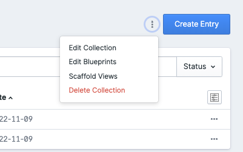
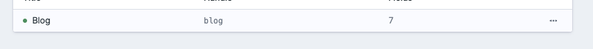
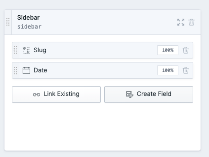
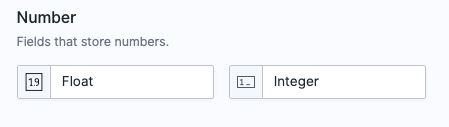
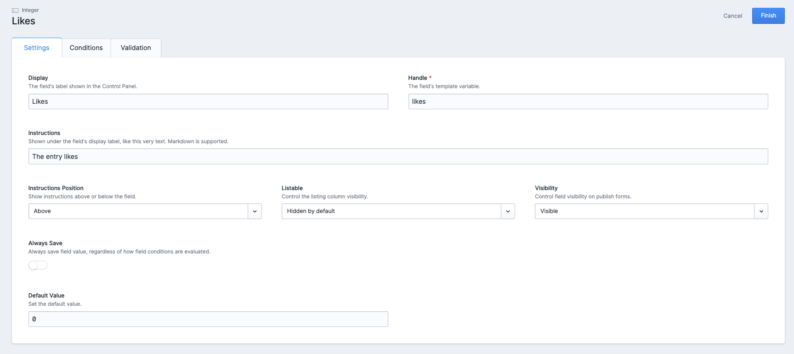
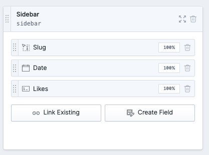
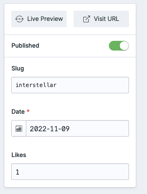

# Author

This addon was created by
<!-- language: lang-none -->
------------------------------------------------------------------------------------------
```
    ____  ____  ____  _____   __   ____  _______   ________________ __ __________  ______
   / __ \/ __ \/ __ )/  _/ | / /  / __ \/ ____/ | / / ____/ ____/ //_// ____/ __ \/ ____/
  / /_/ / / / / __ \ / //  |/ /  / / / / __/ /  |/ / __/ / /   / ,<  / __/ / /_/ / __/   
 / _, _/ /_/ / /_/ // // /|  /  / /_/ / /___/ /|  / /___/ /___/ /| |/ /___/ _, _/ /___   
/_/ |_|\____/_____/___/_/ |_/  /_____/_____/_/ |_/_____/\____/_/ |_/_____/_/ |_/_____/
```
------------------------------------------------------------------------------------------

for education purposes

## Like Button

> Like Button is a Statamic addon that does something pretty neat.

## Features

This addon does:
- Adds & updates the likes attached to your entry (a blog, an event ...)
- No login required
- Adds IP blocking to protect the entry from getting like-spammed

## How to Use

### Installing

``` bash
composer require neckerrman/like
```
Simply add the like button to your entry or the show.**.php and you're off!

OR 

1. Download and place the folder in root
2. Add the following line to composer.json in the require section
```
"neckerrman/like": "dev-main",
```
It should look like this:
```
    "require": {
        "php": "^8.0",
        ...,
        "neckerrman/like": "dev-main",
        ...,
    },
```
3. Add the following at the bottom in your composer.json
```
"repositories": [
        {
            "type": "path",
            "url": "addons/neckerrman/like"
        }
    ]
```
4. Run composer update to add the package
```bash
composer update
```
5. Add {{ like }} to any show.**.php to start using this button!

### Adding custom field in Statamic
1. Navigate to collections and choose edit blueprints by clicking the three dots in the top right corner. <br />

2. Click on the blueprint that you want to edit. <br />

3. In sidebar click 'create field'. <br />

4. Choose the integer field. <br />

5. Add the correct data (name should be Likes and value zero !), save by clicking finish. The field likes is now added! <br />


6. When navigating to an entry you can see the corresponding number of likes. <br />



